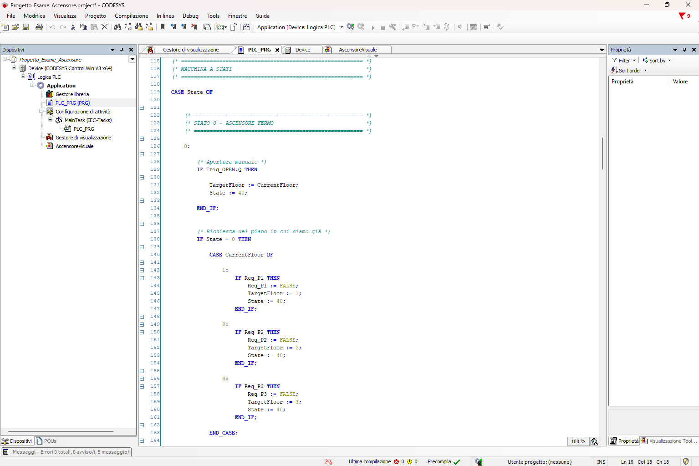
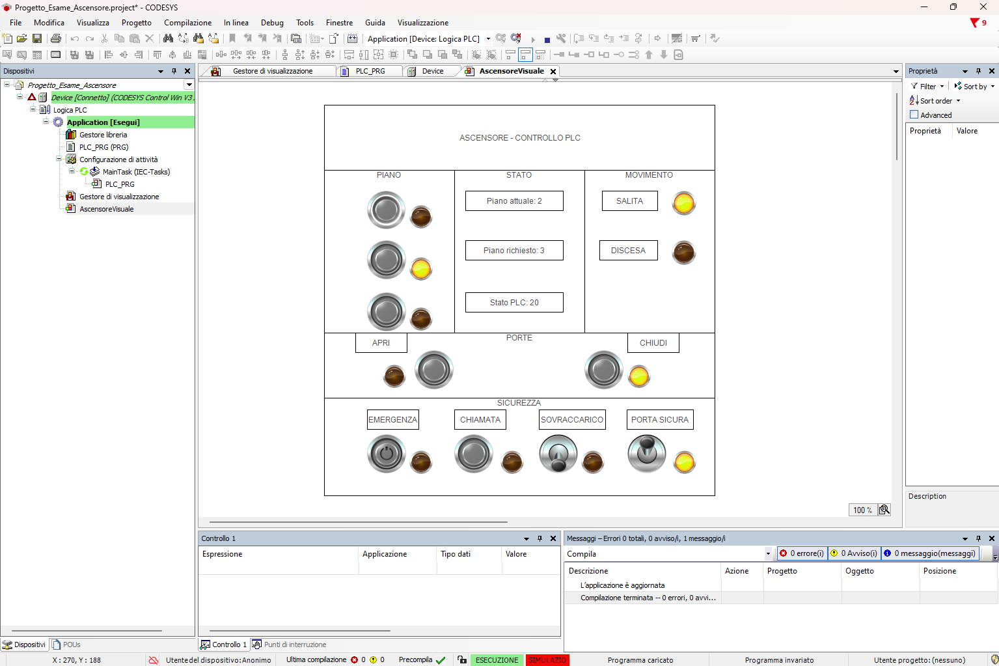
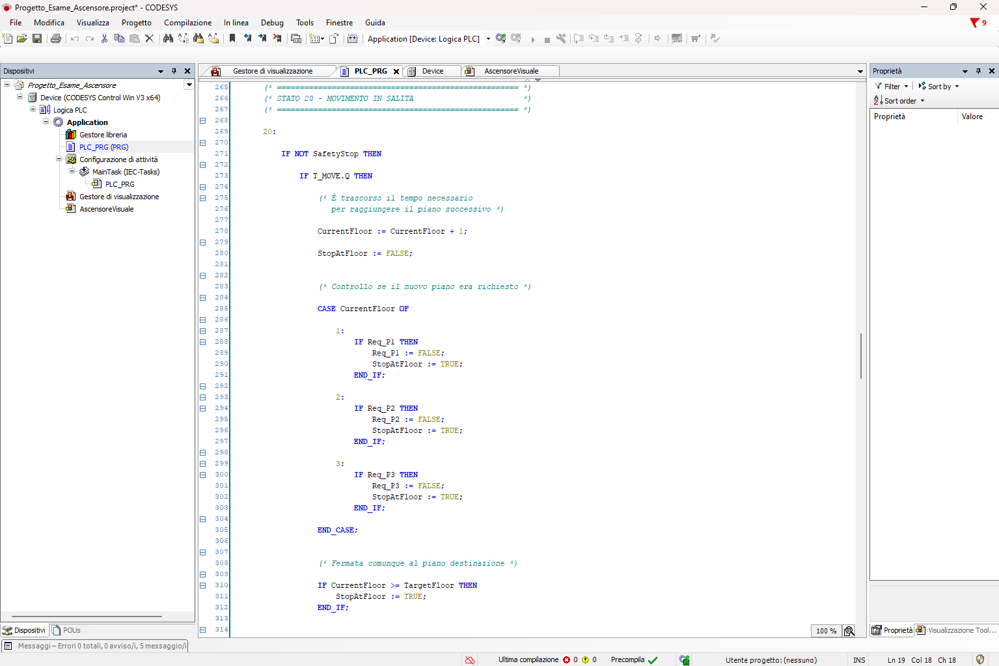
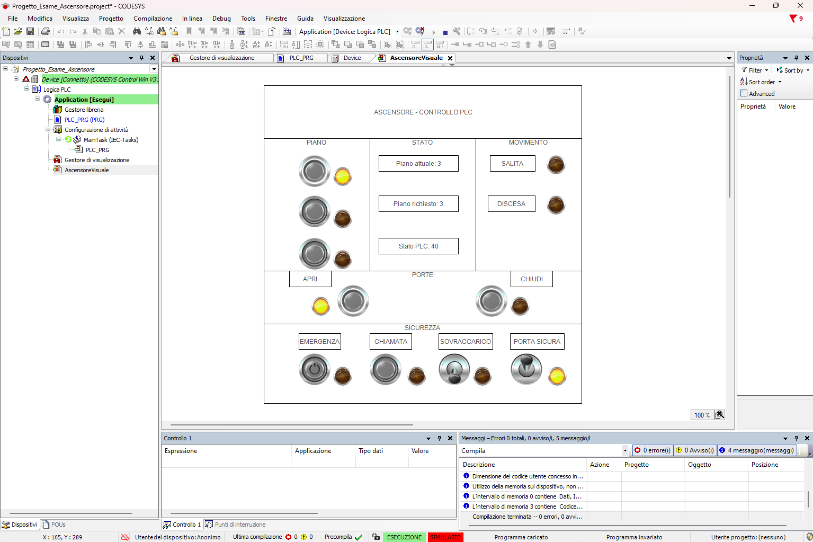
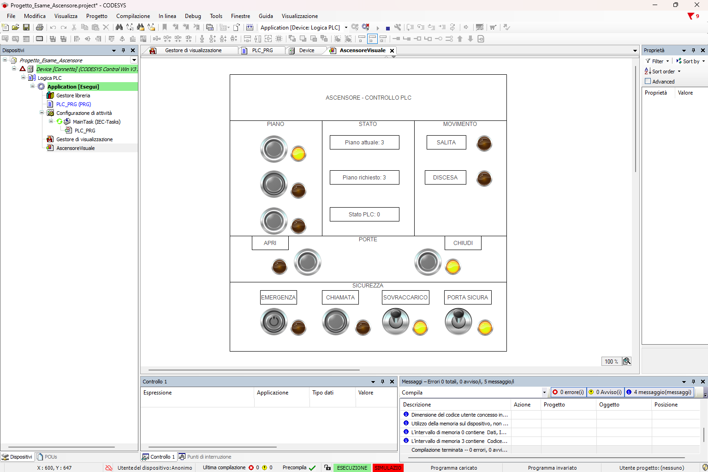
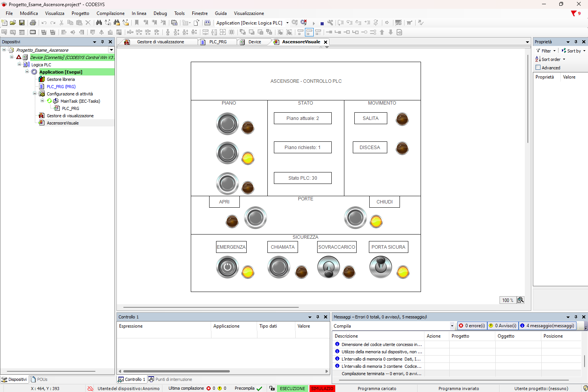
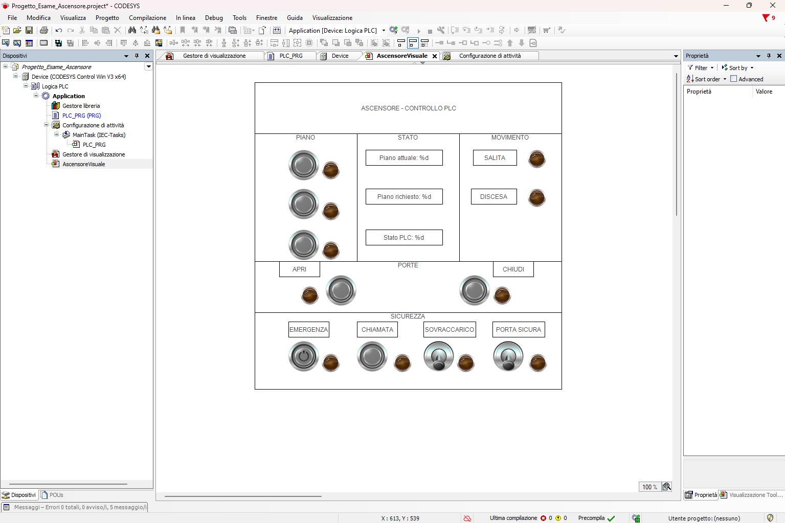

# Ascensore PLC in CODESYS

Progetto di automazione di un **ascensore a 3 piani** sviluppato in **CODESYS** utilizzando il linguaggio **Structured Text (ST)** secondo lo standard IEC 61131-3.

Il progetto è stato realizzato per il corso di **Informatica Industriale** e comprende:

- logica PLC;
- macchina a stati;
- gestione delle richieste di piano;
- temporizzazioni;
- gestione porte;
- controlli di sicurezza;
- arresto di emergenza;
- simulazione tramite HMI CODESYS.

---

## Obiettivo del progetto

L'obiettivo è simulare il funzionamento di un ascensore a tre piani mediante PLC.

Il sistema permette di:

- selezionare i piani 1, 2 e 3;
- memorizzare le richieste di piano;
- gestire salita e discesa;
- effettuare fermate intermedie;
- simulare il tempo di percorrenza tra i piani;
- aprire e chiudere le porte;
- impedire il movimento in condizioni non sicure;
- gestire sovraccarico ed emergenza;
- verificare la corretta chiusura delle porte;
- visualizzare lo stato dell'impianto tramite HMI.

---

## Tecnologie utilizzate

- **CODESYS 3.5 SP21**
- **Structured Text (ST)**
- Standard **IEC 61131-3**
- **CODESYS Control Win V3 x64**
- Simulazione PLC integrata
- **CODESYS Visualization**

---

# Interfaccia HMI

L'interfaccia grafica permette di comandare e monitorare il sistema durante la simulazione.


La HMI mostra:

- piano attuale;
- piano richiesto;
- stato interno del PLC;
- movimento in salita;
- movimento in discesa;
- stato delle porte;
- pulsanti dei tre piani;
- apertura e chiusura porte;
- arresto di emergenza;
- chiamata;
- sovraccarico;
- sensore porta sicura;
- relative segnalazioni luminose.

---

# Funzionamento generale

La sequenza principale del sistema è:

```text
Pressione pulsante piano
        ↓
Rilevamento del fronte
        ↓
Memorizzazione richiesta
        ↓
Controllo condizioni di sicurezza
        ↓
Selezione della direzione
        ↓
Movimento ascensore
        ↓
Timer T_MOVE
        ↓
Aggiornamento piano corrente
        ↓
Controllo richieste intermedie
        ↓
Arrivo al piano
        ↓
Arresto motore
        ↓
Apertura porte
```

---

# Gestione delle richieste

I pulsanti dei tre piani vengono elaborati mediante blocchi `R_TRIG`.

```st
Trig_P1(CLK := PB_P1);
Trig_P2(CLK := PB_P2);
Trig_P3(CLK := PB_P3);
```

In questo modo ogni pressione genera un singolo evento PLC.

Le richieste vengono successivamente memorizzate nelle variabili:

```st
Req_P1
Req_P2
Req_P3
```

Questo permette di non perdere una richiesta anche quando l'ascensore è già impegnato in un'altra corsa.

---

# Macchina a stati

La logica principale dell'ascensore è organizzata mediante una **macchina a stati** implementata con l'istruzione:

```st
CASE State OF
```

Gli stati principali utilizzati sono:

| Stato | Funzione |
|------:|----------|
| `0` | Ascensore fermo con porte chiuse |
| `20` | Movimento in salita |
| `21` | Reset del timer di salita |
| `30` | Movimento in discesa |
| `31` | Reset del timer di discesa |
| `40` | Porte aperte |
| `50` | Chiusura porte / attesa sensore |

La macchina a stati permette di mantenere separate le diverse fasi di funzionamento e di evitare comandi incompatibili tra loro.



---

# Movimento tra i piani

Il movimento dell'ascensore viene simulato tramite un timer `TON`.

Il tempo impostato per percorrere un piano è:

```text
MoveTime = T#5s
```

Durante il movimento il PLC:

1. verifica le condizioni di sicurezza;
2. attende lo scadere di `T_MOVE`;
3. incrementa o decrementa `CurrentFloor`;
4. controlla se il nuovo piano è stato richiesto;
5. verifica il raggiungimento della destinazione;
6. decide se proseguire o fermarsi.

Esempio di movimento verso un piano superiore:



Una parte della logica ST utilizzata per la gestione della salita:



---

# Fermate intermedie

Durante una corsa possono essere memorizzate ulteriori richieste.

Ad ogni nuovo piano raggiunto il PLC verifica:

```st
Req_P1
Req_P2
Req_P3
```

Se il piano corrente è stato richiesto, l'ascensore effettua la fermata prima di proseguire con le richieste successive.

---

# Gestione delle porte

Al raggiungimento della destinazione il motore viene arrestato e il PLC passa allo stato:

```text
State = 40
```

corrispondente alle **porte aperte**.



La HMI dispone inoltre dei comandi:

- `APRI`
- `CHIUDI`

La chiusura può essere richiesta manualmente oppure eseguita dalla logica quando necessario per servire una nuova richiesta.

---

# Sicurezza

Il progetto comprende diversi controlli di sicurezza simulati.

## Sovraccarico

La variabile:

```st
Overload
```

simula il sensore di sovraccarico.

Quando è attivo:

- l'ascensore non può iniziare una nuova corsa;
- il motore rimane disabilitato;
- viene attivata la relativa segnalazione sulla HMI.



---

## Arresto di emergenza

Il comando:

```st
PB_EMERGENCY
```

genera una condizione di arresto di sicurezza.

Durante il movimento:

- `MOTOR_UP` viene disabilitato;
- `MOTOR_DOWN` viene disabilitato;
- viene attivato `LED_ALARM`;
- l'ascensore rimane fermo fino alla rimozione della condizione di emergenza.



---

## Sensore porta sicura

La variabile:

```st
DoorClosedSensor
```

rappresenta il sensore che verifica la corretta chiusura delle porte.

Il movimento è consentito solamente quando:

```text
DoorClosedSensor = TRUE
```

Se la porta non risulta correttamente chiusa durante il movimento, il sistema genera una condizione di arresto.

---

# Chiamata di emergenza

La HMI dispone anche del comando:

```st
PB_CALL
```

La chiamata viene memorizzata tramite `CallActive` e mantenuta attiva per un intervallo temporizzato prima del reset automatico della relativa segnalazione.

---

# Screenshot del progetto

## 1. HMI in condizioni normali

Ascensore fermo e sistema in condizioni operative normali.


---

## 2. Movimento in salita

L'ascensore sta raggiungendo un piano superiore.


---

## 3. Arrivo e apertura porte

L'ascensore ha raggiunto il piano richiesto ed è passato allo stato di apertura porte.


---

## 4. Blocco per sovraccarico

Il sensore di sovraccarico è attivo e impedisce una nuova partenza.


---

## 5. Arresto di emergenza

L'emergenza interrompe il normale funzionamento e disabilita il motore.


---

## 6. Macchina a stati

Implementazione della macchina a stati in Structured Text.


---

## 7. Logica di movimento

Gestione timer, aggiornamento del piano corrente e verifica delle richieste intermedie.


---

## 8. Struttura del progetto CODESYS

Organizzazione dell'applicazione, task PLC e visualizzazione.



---

# Struttura del progetto CODESYS

Il progetto è organizzato principalmente nel seguente modo:

```text
Device
└── Logica PLC
    └── Application
        ├── Gestore libreria
        ├── PLC_PRG
        ├── Configurazione di attività
        │   └── MainTask
        │       └── PLC_PRG
        ├── Gestore di visualizzazione
        └── AscensoreVisuale
```

Il programma `PLC_PRG` contiene la logica principale dell'ascensore ed è eseguito ciclicamente dal `MainTask`.

---

# Struttura del repository

```text
Ascensore-PLC-CODESYS/
│
├── CODESYS/
│   ├── Progetto_Esame_Ascensore.project
│   └── Progetto_Esame_Ascensore.projectarchive
│
├── Images/
│   ├── 01_HMI_Stato_Iniziale.png
│   ├── 02_Movimento_Salita.png
│   ├── 03_Arrivo_Apertura_Porte.png
│   ├── 04_Sicurezza_Sovraccarico.png
│   ├── 05_Arresto_Emergenza.png
│   ├── 06_State_Machine_ST.png
│   ├── 07_State_Machine_Movimento.png
│   └── 08_Struttura_Progetto_CODESYS.png
│
├── Presentation/
│   └── Presentazione_Ascensore_PLC.pptx
│
├── Docs/
│
├── .gitattributes
├── .gitignore
└── README.md
```

---

# Come aprire il progetto

È possibile utilizzare direttamente:

```text
CODESYS/Progetto_Esame_Ascensore.project
```

oppure importare l'archivio:

```text
CODESYS/Progetto_Esame_Ascensore.projectarchive
```

L'archivio è utile per trasferire il progetto e le relative dipendenze su un'altra installazione di CODESYS.

---

# Esecuzione in simulazione

Il progetto può essere testato senza un PLC fisico utilizzando la modalità **Simulazione** di CODESYS.

Procedura generale:

1. aprire il progetto;
2. compilare l'applicazione;
3. attivare la modalità `Simulazione`;
4. effettuare il login;
5. scaricare l'applicazione;
6. avviare il PLC;
7. aprire `AscensoreVisuale`;
8. utilizzare la HMI per testare il sistema.

---

# Principali variabili

| Variabile | Funzione |
|---|---|
| `CurrentFloor` | Piano corrente |
| `TargetFloor` | Piano di destinazione |
| `Req_P1` | Richiesta piano 1 |
| `Req_P2` | Richiesta piano 2 |
| `Req_P3` | Richiesta piano 3 |
| `MOTOR_UP` | Comando salita |
| `MOTOR_DOWN` | Comando discesa |
| `DOOR_OPEN` | Comando apertura porte |
| `DOOR_CLOSE` | Comando chiusura porte |
| `PB_EMERGENCY` | Arresto di emergenza |
| `Overload` | Sensore sovraccarico |
| `DoorClosedSensor` | Sensore porte correttamente chiuse |
| `SafetyStop` | Condizione di arresto di sicurezza |
| `State` | Stato corrente della macchina a stati |

---

# Timer utilizzati

| Timer | Funzione |
|---|---|
| `T_MOVE` | Simulazione del tempo di percorrenza tra due piani |
| `T_DOOR` | Temporizzazione relativa alla gestione delle porte |
| `T_CALL` | Temporizzazione della segnalazione di chiamata |

---

# Possibili sviluppi futuri

Il progetto potrebbe essere ulteriormente esteso con:

- numero maggiore di piani;
- pulsanti di chiamata esterni su ogni piano;
- priorità delle richieste in funzione della direzione;
- visualizzazione testuale dello stato invece del codice numerico;
- gestione guasti;
- sensori di presenza sulle porte;
- registrazione degli eventi;
- simulazione più realistica del movimento;
- utilizzo di hardware PLC reale.

---

# Nota sulla sicurezza

Questo progetto è una **simulazione didattica**.

Le funzioni di emergenza e sicurezza implementate nel software hanno lo scopo di dimostrare la logica di controllo PLC.

In un ascensore reale, le funzioni di sicurezza richiederebbero dispositivi, circuiti e sistemi certificati specificamente per applicazioni safety.

---

# Autore

**Davide Martiniello**

Progetto realizzato per il corso di **Informatica Industriale**.